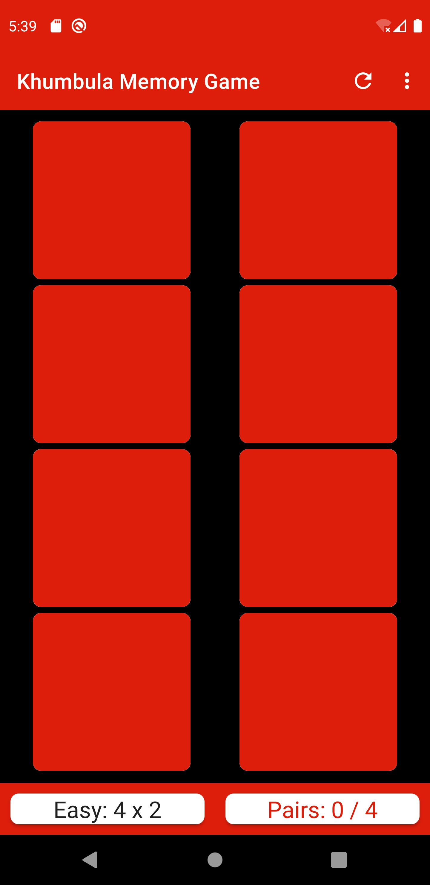
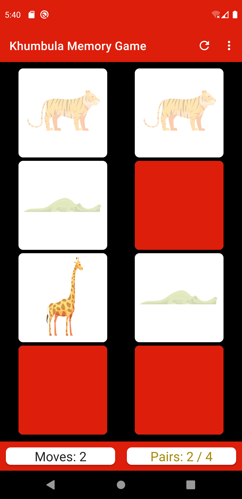
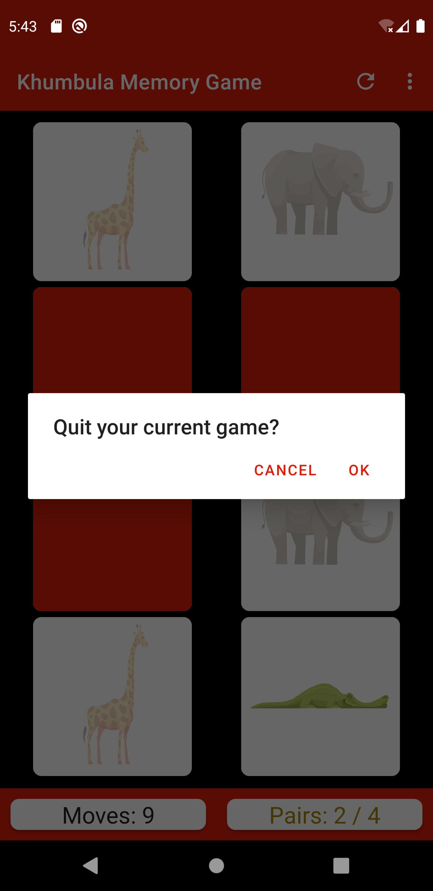
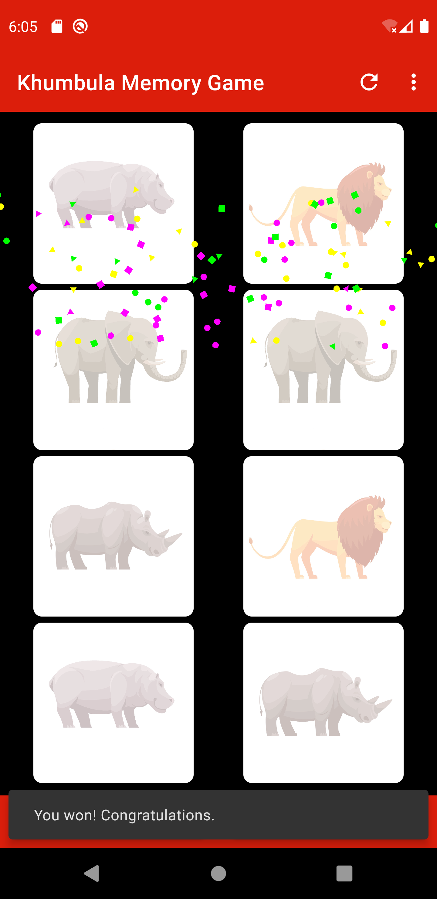
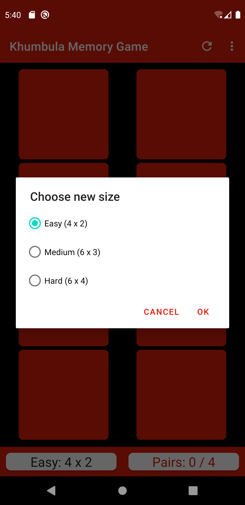

# Khumbula-Memory-Game
Khumbula, meaning "remember" in the Zulu language, is a matching game that serves the goal of sharpening our user’s short-term memory by finding pairs of tiles in the shortest number of moves. I hope you enjoy playing Khumbula as much as I did developing it. 

Play now!
(Coming soon to the Android Play Store)

App UI
---------------------
<p float="left">





</p>

Attribution
---------------------
Animal vector images:
- <a href="https://www.freepik.com/vectors/abstract">Abstract vector created by macrovector - www.freepik.com</a>

Open Source Confetti Library:
- Confetti: https://github.com/jinatonic/confetti

Digital Design Tool (Icons and Featured Images)
- https://sketchpad.app/

Image Resizing Tool (Icons and Featured Images):
- https://promo.com/tools/image-resizer/?utm_campaign=image-resizer-share

License
----------------------
```
Copyright 2020 Vusumuzi Ngwazini

Licensed under the Apache License, Version 2.0 (the "License");
you may not use this file except in compliance with the License.
You may obtain a copy of the License at

    http://www.apache.org/licenses/LICENSE-2.0

Unless required by applicable law or agreed to in writing, software
distributed under the License is distributed on an "AS IS" BASIS,
WITHOUT WARRANTIES OR CONDITIONS OF ANY KIND, either express or implied.
See the License for the specific language governing permissions and
limitations under the License.
